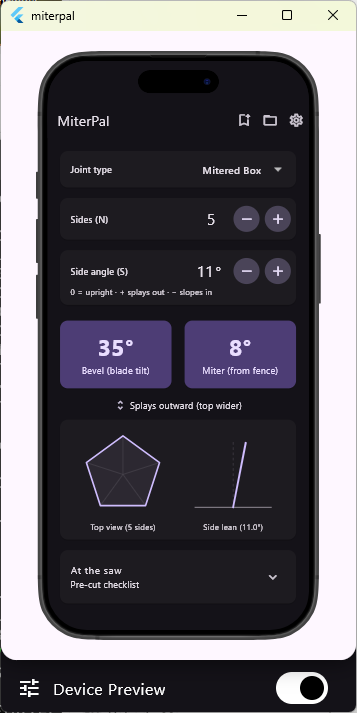

# MiterPal

A smartphone app for calculating miter saw settings for compound-miter / N-sided box (stave) construction.

**Status:** MVP (v0.1.0). Calculation core ported and tested; calculator UI
with four joint modes (Picture Frame, Mitered Box, Butt Joint Box, Fixed
Bevel Bit), save/recall, live diagram, settings menu, and dark mode. The app
ships two ways: an installable **web app (PWA)** you can use on a phone right
now, and a **Flutter app** (currently running as a Windows desktop
simulation) headed for the iOS App Store first, Android later.

## Try it now — web app

No install, no app store:

**→ <https://bobm123.github.io/MiterPal/webapp/>**

Open it in any phone, tablet, or desktop browser. To make it a home-screen
app (recommended — full screen, works offline in the shop, and saved projects
persist reliably):

- **iOS Safari:** Share → **Add to Home Screen**
- **Android Chrome:** menu → **Add to Home screen** (or accept the install prompt)

Details, local hosting, and update notes are in
[`webapp/README.md`](webapp/README.md).



*A typical calculation: a 5-sided mitered box with sides leaning 11° — set
the saw to a 35° bevel and an 8° miter.*

## What it does

Given two inputs:

- **N** — number of sides (4 = square box, 6 = hexagonal, etc.)
- **S** — side angle from vertical, in degrees (`S = 0` upright, `S > 0` splays outward, `S < 0` slopes inward)

it computes the saw settings:

- **D** — dihedral angle between adjacent sides
- **B** — blade tilt / bevel (from vertical)
- **M** — miter angle on the saw table
- **M'** — miter complement (90° − M), for saws that measure from the blade

The math, derivation, sanity checks, and worked examples live in [`docs/compound-miter-angles.md`](docs/compound-miter-angles.md). A reference implementation of the formulas is in [`scripts/compound_miter.py`](scripts/compound_miter.py).

## Platforms

- **Web app (PWA):** available now — iOS, Android, and desktop browsers.
- **Flutter app:** iOS App Store first, Android later.

## Try it on Windows (Flutter desktop simulation)

The Flutter app isn't in the app stores yet, but the complete experience runs
on any Windows PC. One-time tool setup:

1. Install the [Flutter SDK](https://docs.flutter.dev/get-started/install/windows)
   (stable channel) and make sure `flutter` is on your PATH.
2. Install [Visual Studio 2022 Community](https://visualstudio.microsoft.com/)
   with the **Desktop development with C++** workload — Flutter needs it for
   Windows desktop builds. (Stay on VS **2022**; VS 2026 currently breaks
   Flutter's Windows build.)
3. Check the setup with `flutter doctor` — Flutter and Visual Studio should
   both show a check mark.

Then clone and run (this repo includes the Dart source and the generated
`windows/` runner):

```
git clone https://github.com/bobm123/MiterPal.git
cd MiterPal
flutter pub get        # fetch dependencies
flutter run -d windows # build + launch
```

Debug builds open inside a phone-frame simulator
([`device_preview`](https://pub.dev/packages/device_preview)): pick an iPhone
or Pixel in the side panel, rotate it, toggle dark mode, or switch the preview
off for a plain desktop window. Release builds run the app directly.

Add other platform targets later with e.g. `flutter create --platforms=android,ios .`

Run the tests with:

```
flutter test
```

> **Project location:** this project must live on an **NTFS** drive (e.g.
> `C:\Projects\MiterPal`), not the exFAT D: drive. Flutter creates a symbolic
> link per plugin during the build, and exFAT doesn't support symlinks — builds
> fail there with `ERROR_INVALID_FUNCTION`. The Flutter SDK itself can stay on D:.
> See [`docs/SETUP-WINDOWS.md`](docs/SETUP-WINDOWS.md) for full environment setup.

## Layout

```
lib/
  main.dart                 app entry + theme
  models/
    compound_miter.dart     calculation core (ported from scripts/compound_miter.py)
    saved_project.dart      saved-calculation model
  state/
    calculator_controller.dart   ChangeNotifier holding inputs + settings + saved list
  services/
    project_store.dart      saved-project persistence (shared_preferences)
    settings_store.dart     theme-mode persistence
  util/
    formatting.dart         angle rounding (0.5°) + display
  widgets/                  inputs, result cards, live diagram, cut checklist
  screens/                  calculator, saved-projects, settings screens
test/                       unit tests (verified against the reference values)
docs/                       reference math, diagrams, Windows setup, trade study
scripts/                    canonical Python algorithm script
webapp/                     JavaScript port, installable as a PWA (see webapp/README.md)
DECISIONS.md                settled design choices
DESIGN-QUESTIONS.md         remaining open questions
```

## v1 scope (per DECISIONS.md)

Implemented: N stepper and S field (with +/− nudge and decimal entry), a live
Bevel/Miter readout, a live polygon + lean diagram (even N rests on a flat edge),
the in-the-workshop cut checklist, save/recall of projects, and a Settings menu behind
the gear icon (advanced D/M', 0.5°-vs-exact precision, dark mode). Saved projects
and the theme choice persist to disk via `shared_preferences`.
