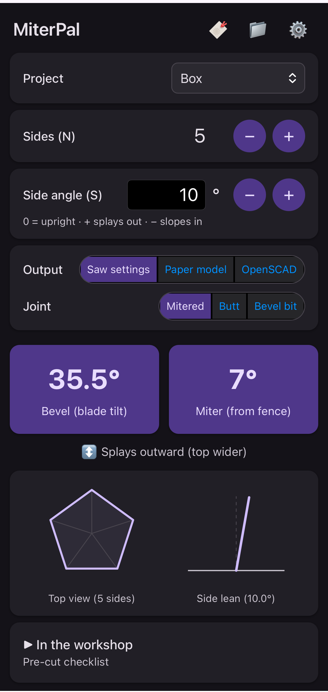
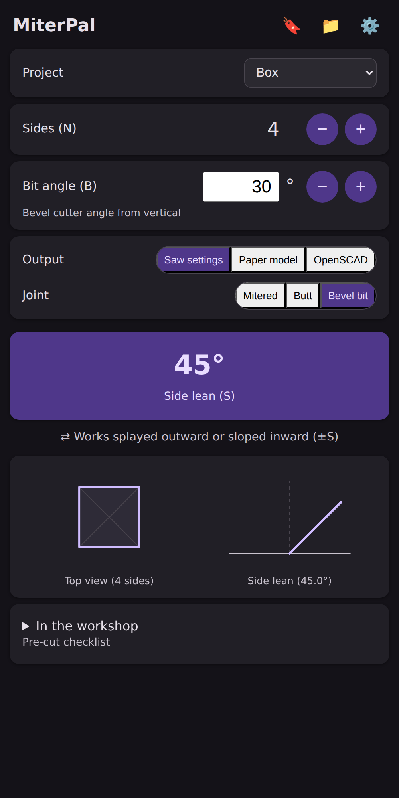
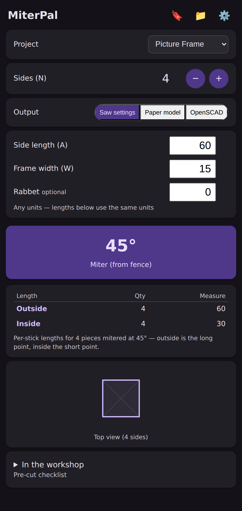
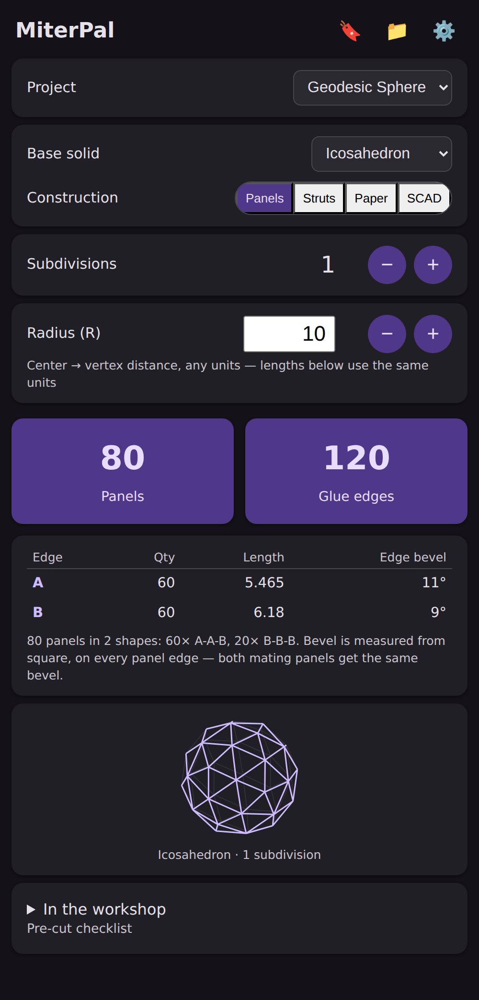
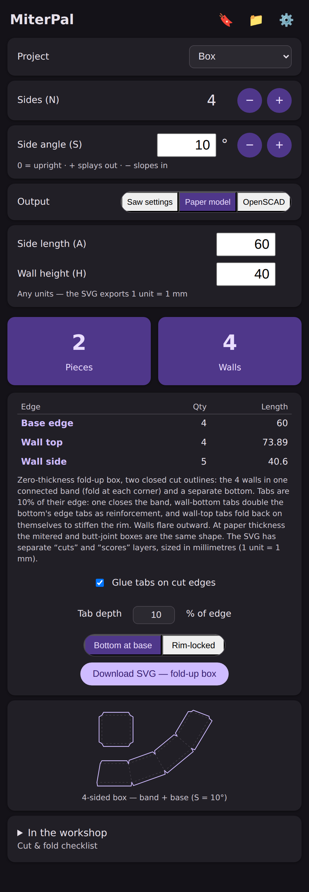
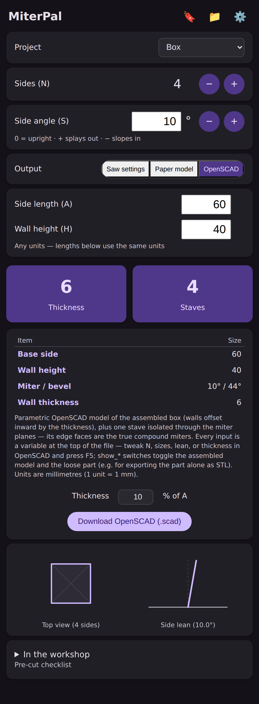
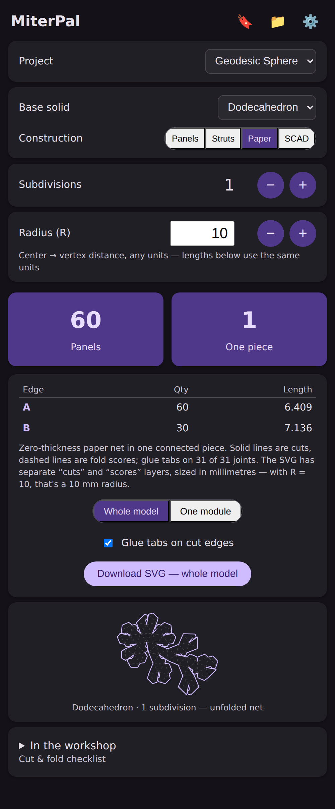

# MiterPal

A web app that turns joint geometry into saw settings: compound miters for
N-sided boxes and picture frames, stave angles for fixed-bevel router bits,
and complete cut lists for geodesic spheres — including printable
cut-and-fold paper nets.

**→ Use it now: <https://bobm123.github.io/MiterPal/webapp/>**

Works in any phone, tablet, or desktop browser. To make it a home-screen app
(recommended — full screen, works offline in the shop, and saved projects
persist reliably):

- **iOS Safari:** Share → **Add to Home Screen**
- **Android Chrome:** menu → **Add to Home screen** (or accept the install prompt)

<p align="center">
  
</p>

*A typical calculation: a 5-sided box with sides leaning 10° — set the saw to
a 35.5° bevel and a 7° miter.*

## What it does

Pick a project, set the inputs, and read the settings off the cards:

- **Picture Frame** — flat N-sided frame: the miter angle, plus per-stick
  outside/inside/rabbet lengths.
- **Box** — N-sided box with leaning sides. The saw-settings output has a
  **Joint** selector: *Mitered* (blade bevel + table miter, with dihedral D
  and miter complement M′ behind an advanced toggle), *Butt* (ends cut flush
  against the neighbor: the adjusted blade tilt), or *Bevel bit* (the cutter
  fixes the bevel, so MiterPal returns the side lean that fits it).
- **Geodesic Sphere** — pick a base solid (tetrahedron, cube, octahedron,
  dodecahedron, icosahedron), subdivisions, and a radius. Construction
  outputs: beveled **panels** (edge lengths + glue bevels), **hub-and-strut**
  (strut lengths, end-cut angles, hub inventory), **paper** — an SVG
  cut-and-fold net of the whole model or one repeating module, with separate
  *cuts* and *scores* layers for CNC paper cutters — or **OpenSCAD**, a
  parametric solid model.

The Box and Picture Frame projects also offer **paper model** (fold-up SVG
template) and **OpenSCAD** (parametric solid with wall thickness) outputs.

Every mode has a live diagram, project save/recall, 0.5°-or-exact precision,
dark mode, and a pre-cut checklist. Everything runs locally in the browser —
no accounts, no network needed after the first load.

The math behind it (derivations, sanity checks, worked examples) is in
[`docs/compound-miter-angles.md`](docs/compound-miter-angles.md), with a
reference implementation in [`scripts/compound_miter.py`](scripts/compound_miter.py).

## Screens

<table>
  <tr>
    <td align="center" width="33%"><br><sub><b>Box</b> — Joint selector (bevel-bit shown)</sub></td>
    <td align="center" width="33%"><br><sub><b>Picture Frame</b> — miter + cut lengths</sub></td>
    <td align="center" width="33%"><br><sub><b>Geodesic Sphere</b> — panel cut list</sub></td>
  </tr>
  <tr>
    <td align="center"><br><sub><b>Box</b> — fold-up paper model</sub></td>
    <td align="center"><br><sub><b>Box</b> — parametric OpenSCAD</sub></td>
    <td align="center"><br><sub><b>Geodesic Sphere</b> — cut-and-fold net</sub></td>
  </tr>
</table>

<!--
  Real-world outputs — drop photos into images/ and uncomment a row like this:
  <table>
    <tr>
      <td align="center"><br><sub>OpenSCAD model, 3D-printed</sub></td>
      <td align="center"><br><sub>Paper net cut on a craft plotter and folded up</sub></td>
    </tr>
  </table>
-->

## Deploy your own copy

The app is static files — the `webapp/` folder is the whole thing, no build
step, no dependencies.

- **GitHub Pages:** fork this repo, then *Settings → Pages → Deploy from a
  branch*, branch `main`, folder `/ (root)`. About a minute later your copy
  is live at `https://<your-username>.github.io/MiterPal/webapp/`.
- **Any static host or local network:** copy `webapp/` to any web server, or
  serve it straight from a clone (`cd webapp && python -m http.server 8000`)
  and open it from a phone on the same network.

When you change the app, bump `CACHE_VERSION` in `webapp/sw.js` in the same
commit — that's how installed (home-screen) copies know to fetch the update.
Implementation details are in [`webapp/README.md`](webapp/README.md).

## Repository layout

```
webapp/               the app — single-file index.html + PWA wrapper (webapp/README.md)
images/               README screenshots
docs/                 math derivation + diagrams, Windows setup, framework trade study
scripts/              canonical Python reference for the miter formulas
lib/ test/ windows/   Flutter port, planned future native app (lib/README.md)
DECISIONS.md          settled design choices
DESIGN-QUESTIONS.md   open questions and future work
```

## Roadmap

Current development happens in the web app. A Flutter port of the four
box/frame modes runs today as a Windows desktop simulation and is the plan of
record for future native iOS/Android releases — see
[`lib/README.md`](lib/README.md).
