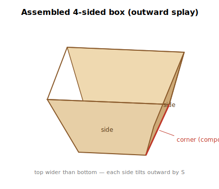
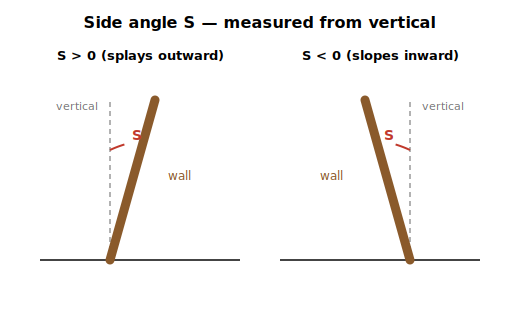
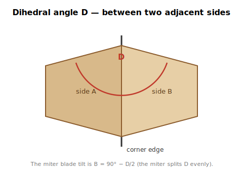
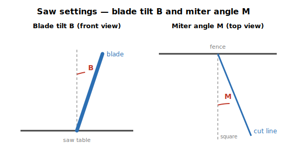

# Compound Miter Angle Calculation

Walkthrough for the **N-sided box / stave construction** case — boards stand on end like the staves of a barrel or planter, with their edges meeting at the corners. Reference: <https://jansson.us/jcompound.html>.



## The setup

Two inputs:

- **N** = number of sides (4 for a square box, 6 for hexagonal, etc.)
- **S** = side angle from vertical, in degrees.
  - `S = 0` — sides perfectly upright
  - `S > 0` — box splays outward (top wider than bottom — bowl, planter)
  - `S < 0` — walls slope inward (top narrower than bottom — truncated pyramid, hopper)



Four outputs:

- **D** = dihedral angle between adjacent sides
- **B** = blade tilt (bevel) for the miter cut, measured from vertical
- **M** = miter angle on the saw table
- **M'** = miter complement (90° − M), useful if your saw measures the other way

Half-segment angle `α = 180°/N` shows up everywhere — it's half the angle of one segment of the polygon (45° for square, 36° for pentagon, 30° for hexagon).

## The formulas

```
cos(D) = 2 · cos²(S) · sin²(α) − 1
B      = 90° − D / 2
M      = arctan( sin(S) · tan(α) )
M'     = 90° − M
```

The blade tilt comes straight from the dihedral: a symmetric miter splits the dihedral, so each board's bevel face sits at `D/2` from the joint plane, which means the blade tilts `90° − D/2` from vertical.



### Sign of S

The dihedral and blade tilt depend on `cos²S`, so they're identical for `+S` and `−S` — an outward-splayed box and an inward-sloped box of the same magnitude have the same joint geometry. The miter angle `M` follows the sign of `S`: positive for outward splay, negative for inward. At the saw you set the absolute value of M; the sign just tells you which way to swing the miter gauge relative to a splayed box.

## Sanity checks

- **Upright box, S = 0** (vertical staves): `cos D = 2·sin²α − 1 = −cos(2α)`, so `D = 180° − 2α`. For N=4: D = 90°, B = 45°, M = 0°. That's edge-gluing four boards into a square tube — 45° rip on each edge, square crosscuts. ✓
- **N=5, S=10°** (Jansson's example): D ≈ 109.3°, B ≈ 35.4°, M ≈ 7.2°, M' ≈ 82.8°. ✓
- **N=6, S=20°**: D ≈ 124.0°, B ≈ 28.0°, M ≈ 11.2°.
- **N=5, S=−10°** (inward-sloped): D ≈ 109.3°, B ≈ 35.4°, M ≈ −7.2° — same joint as S=+10°, opposite miter direction.

## Worked example — hexagonal planter, S = 15°

- α = 30°, so sin α = 0.5, tan α = 0.5774, cos²S = 0.9330
- `cos D = 2 · 0.9330 · 0.25 − 1 = −0.5335` → **D ≈ 122.25°**
- `B = 90° − 61.12° ≈ 28.88°` blade tilt from vertical
- `M = arctan(sin 15° · tan 30°) = arctan(0.2588 · 0.5774) = arctan(0.1494) ≈ 8.50°`
- `M' = 81.50°`

Set the blade to ~28.9° and the miter gauge to ~8.5° from square (or 81.5° if your saw reads from the blade).

## At the saw



1. Cut a test piece on scrap first — sign errors and which-edge-up mistakes are the #1 source of trouble in compound miters.
2. Both edges of every piece get the same B and M, but the board is flipped end-for-end between cuts. Mark the "outside face" on every blank before you start.
3. If your saw measures miter from the *blade* (0° = crosscut) rather than from the fence, use **M'** instead.

## Script

`compound_miter.py` in this directory implements the formulas. Run as:

```
python compound_miter.py --n 6 --tilt 15
```

Defaults: `N=4`, `tilt=0`. Negative `--tilt` is supported for inward-sloping walls. Output is JSON with all four computed angles plus a `lean_direction` field (`outward` / `inward` / `vertical`).
